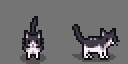
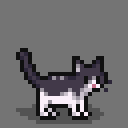

# Ichortower's Wobbly Cat

Adds a wobbly, pudgy tuxedo cat breed to Stardew Valley, in memory of my dear
departed cat.

I hope she can bring you joy!

(The animations are supposed to look a little janky. She was a [wobbly
cat](https://vetmed.tamu.edu/news/pet-talk/wobbly-cat-syndrome/).)

(I don't know how she will look wearing a hat. My guess is: not great.)

## How to Use

This mod adds an additional cat breed using [Content
Patcher](https://github.com/Pathoschild/StardewMods/tree/develop/ContentPatcher):
therefore, you will need SMAPI and Content Patcher in order to use it. The new
breed will show up in the character creation menu like the vanilla cats; if you
are adding this mod to an established farm, you should be able to switch cat
breeds at the Shrine of Illusions at the Wizard's tower.
